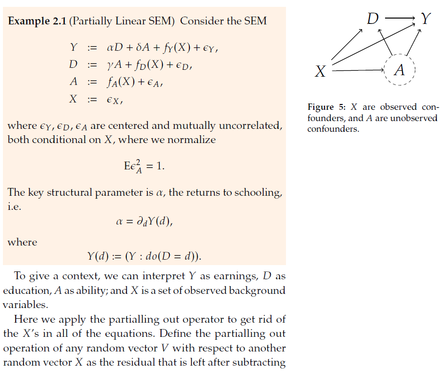
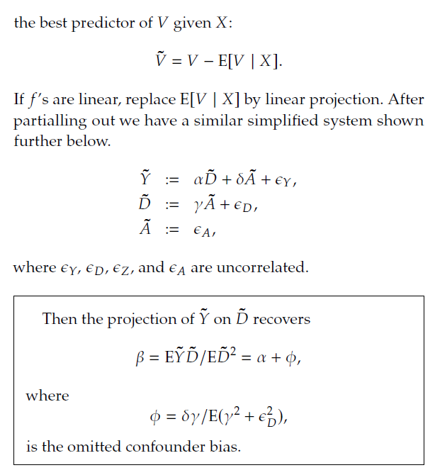
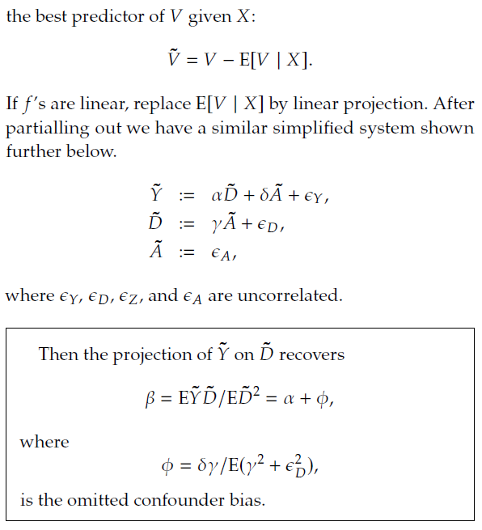
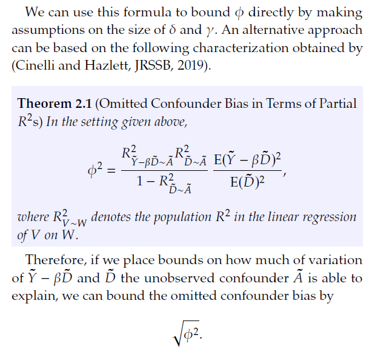

# Sensititivy Analysis for Unobserved Confounder with DML and Sensmakr


## Here we experiment with using package "sensemakr" in conjunction with debiased ML







## We will work on: 

* Mimic the partialling out procedure with machine learning tools, 

* And invoke Sensmakr to compute $\phi^2$ and plot sensitivity results.


<style>
  .col2 {
    columns: 2 200px;         /* number of columns and width in pixels*/
    -webkit-columns: 2 200px; /* chrome, safari */
    -moz-columns: 2 200px;    /* firefox */
  }
  .col3 {
    columns: 3 100px;
    -webkit-columns: 3 100px;
    -moz-columns: 3 100px;
  }
</style>


:::::: {.columns}
::: {.column width="49.5%" data-latex="{0.48\textwidth}"}
```{r  message=FALSE, warning=FALSE }
# loads package
#install.packages("sensemakr")
library(sensemakr)

# loads data
data("darfur")
```

:::
::: {.column width="1%" data-latex="{0.04\textwidth}"}
\ 
<!-- an empty Div (with a white space), serving as
a column separator -->
:::
:::::: {.column width="49.5%" data-latex="{0.48\textwidth}"}

```{python}
import warnings
warnings.filterwarnings("ignore")
from sensemakr import sensemakr
from sensemakr import sensitivity_stats
from sensemakr import bias_functions
from sensemakr import ovb_bounds
from sensemakr import ovb_plots
import statsmodels.api as sm
import statsmodels.formula.api as smf
import numpy as np
import pandas as pd

# loads data
darfur = pd.read_csv("data/darfur.csv")
```
:::
::::::
\newline


Data is described here 
https://cran.r-project.org/web/packages/sensemakr/vignettes/sensemakr.html

The main outcome is attitude towards peace -- the peacefactor.
The key variable of interest is whether the responders were directly harmed (directlyharmed).
We want to know if being directly harmed in the conflict causes people to support peace-enforcing measures.
The measured confounders include female indicator, age, farmer, herder, voted in the past, and household size.
There is also a village indicator, which we will treat as fixed effect and partial it out before conducting
the analysis. The standard errors will be clustered at the village level.

## Take out village fixed effects and run basic linear analysis


:::::: {.columns}
::: {.column width="49.5%" data-latex="{0.48\textwidth}"}
```{r  message=FALSE, warning=FALSE}
#get rid of village fixed effects
attach(darfur)
library(lfe)

peacefactorR<- lm(peacefactor~village)$res
directlyharmedR<-  lm(directlyharmed~village)$res
femaleR<-  lm(female~village)$res
ageR<-     lm(age~village)$res
farmerR<-  lm(farmer_dar~village)$res
herderR<-  lm(herder_dar~village)$res
pastvotedR<- lm(pastvoted~village)$res
hhsizeR<-   lm(hhsize_darfur~village)$res
```

:::
::: {.column width="1%" data-latex="{0.04\textwidth}"}
\ 
<!-- an empty Div (with a white space), serving as
a column separator -->
:::
:::::: {.column width="49.5%" data-latex="{0.48\textwidth}"}

```{python}
# get rid of village fixed effects
import statsmodels.api as sm
import statsmodels.formula.api as smf

peacefactorR = smf.ols('peacefactor~village' , data=darfur).fit().resid
directlyharmedR = smf.ols('directlyharmed~village' , data=darfur).fit().resid
femaleR = smf.ols('female~village' , data=darfur).fit().resid
ageR = smf.ols('age~village' , data=darfur).fit().resid
farmerR = smf.ols('farmer_dar~village' , data=darfur).fit().resid
herderR = smf.ols('herder_dar~village' , data=darfur).fit().resid
pastvotedR = smf.ols('pastvoted~village' , data=darfur).fit().resid
hhsizeR = smf.ols('hhsize_darfur~village' , data=darfur).fit().resid

### Auxiliary code to rearrange data
darfurR = pd.concat([peacefactorR, directlyharmedR, femaleR,
                    ageR, farmerR, herderR, pastvotedR, 
                     hhsizeR, darfur['village']], axis=1)
darfurR.columns = ["peacefactorR", "directlyharmedR", "femaleR",
                    "ageR", "farmerR", "herderR", "pastvotedR", 
                     "hhsize_darfurR", "village"]
    
```
:::
::::::
\newline


:::::: {.columns}
::: {.column width="49.5%" data-latex="{0.48\textwidth}"}
```{r  message=FALSE, warning=FALSE}
# Preliminary linear model analysis
# here we are clustering standard errors at the village level
summary(felm(peacefactorR~ directlyharmedR+ 
               femaleR + ageR + 
               farmerR+ herderR + pastvotedR + 
             hhsizeR |0|0|village))
```

:::
::: {.column width="1%" data-latex="{0.04\textwidth}"}
\ 
<!-- an empty Div (with a white space), serving as
a column separator -->
:::
:::::: {.column width="49.5%" data-latex="{0.48\textwidth}"}

```{python}
# Preliminary linear model analysis
# here we are clustering standard errors at the village level
linear_model_1 = smf.ols('peacefactorR~ directlyharmedR+ femaleR + ageR + farmerR+ herderR + pastvotedR + hhsizeR' 
        ,data=darfurR ).fit().get_robustcov_results(cov_type = "cluster", groups= darfurR['village'])
linear_model_1_table = linear_model_1.summary2().tables[1]
linear_model_1_table
```
:::
::::::
\newline


:::::: {.columns}
::: {.column width="49.5%" data-latex="{0.48\textwidth}"}
```{r  message=FALSE, warning=FALSE }
# here we are clustering standard errors at the village level

summary(felm(peacefactorR~ femaleR +
              ageR + farmerR+ herderR + 
             pastvotedR + hhsizeR |0|0|village))
```

:::
::: {.column width="1%" data-latex="{0.04\textwidth}"}
\ 
<!-- an empty Div (with a white space), serving as
a column separator -->
:::
:::::: {.column width="49.5%" data-latex="{0.48\textwidth}"}

```{python}
# Linear model 2 
linear_model_2 = smf.ols('peacefactorR~ femaleR + ageR + farmerR+ herderR + pastvotedR + hhsizeR' 
        ,data=darfurR ).fit().get_robustcov_results(cov_type = "cluster", groups= darfurR['village'])
linear_model_2_table = linear_model_2.summary2().tables[1]
linear_model_2_table
```
:::
::::::
\newline


:::::: {.columns}
::: {.column width="49.5%" data-latex="{0.48\textwidth}"}
```{r  message=FALSE, warning=FALSE }
# here we are clustering standard errors at the village level

summary(felm(directlyharmedR~ femaleR +
                     ageR + farmerR+ herderR + 
             pastvotedR + hhsizeR |0|0|village))
```

:::
::: {.column width="1%" data-latex="{0.04\textwidth}"}
\ 
<!-- an empty Div (with a white space), serving as
a column separator -->
:::
:::::: {.column width="49.5%" data-latex="{0.48\textwidth}"}

```{python}
# Linear model 3
linear_model_3 = smf.ols('directlyharmedR~ femaleR + ageR + farmerR+ herderR + pastvotedR + hhsizeR' 
        ,data=darfurR ).fit().get_robustcov_results(cov_type = "cluster", groups= darfurR['village'])
linear_model_3_table = linear_model_3.summary2().tables[1]
linear_model_3_table
```
:::
::::::
\newline


## We first use Lasso for Partilling Out Controls


:::::: {.columns}
::: {.column width="49.5%" data-latex="{0.48\textwidth}"}
```{r  message=FALSE, warning=FALSE }
library(hdm)

resY =  rlasso(peacefactorR ~  (femaleR +
                        ageR + 
                        farmerR+ 
                        herderR + 
                        pastvotedR + 
                        hhsizeR)^3, post=F)$res

resD =  rlasso(directlyharmedR ~  (femaleR +
                        ageR + 
                        farmerR + 
                        herderR + 
                        pastvotedR + 
                        hhsizeR)^3 , post=F)$res
```

:::
::: {.column width="1%" data-latex="{0.04\textwidth}"}
\ 
<!-- an empty Div (with a white space), serving as
a column separator -->
:::
:::::: {.column width="49.5%" data-latex="{0.48\textwidth}"}

```{python}
import hdmpy
import patsy 
from patsy import ModelDesc, Term, EvalFactor

X = patsy.dmatrix("(femaleR + ageR + farmerR+ herderR + pastvotedR + hhsizeR)**3", darfurR)
Y = darfurR['peacefactorR'].to_numpy()
D = darfurR['directlyharmedR'].to_numpy()

resY = hdmpy.rlasso(X[: , 1:],Y, post = False).est['residuals'].reshape( Y.size,)
resD = hdmpy.rlasso(X[: , 1:],D, post = False).est['residuals'].reshape( D.size,)
FVU_Y = 1 - np.var(resY)/np.var(peacefactorR)
FVU_D = 1 - np.var(resD)/np.var(directlyharmedR)
```
:::
::::::
\newline


:::::: {.columns}
::: {.column width="49.5%" data-latex="{0.48\textwidth}"}
```{r  message=FALSE, warning=FALSE }
summary( rlasso(peacefactorR ~  (femaleR +
                     ageR + 
                     farmerR+ 
                     herderR + 
                     pastvotedR + 
                     hhsizeR)^3, 
                post=F) )
```

:::
::: {.column width="1%" data-latex="{0.04\textwidth}"}
\ 
<!-- an empty Div (with a white space), serving as
a column separator -->
:::
:::::: {.column width="49.5%" data-latex="{0.48\textwidth}"}

```{python}
rlasso_1 = hdmpy.rlasso(X[: , 1:],Y, post = False)

def summary_rlasso( mod , X1):
    ob1 = mod.est['coefficients'].rename(columns = { 0 : "Est."})
    ob1.index = X1.design_info.column_names
    return ob1

summary_rlasso(rlasso_1 , X)
```
:::
::::::
\newline


:::::: {.columns}
::: {.column width="49.5%" data-latex="{0.48\textwidth}"}
```{r  message=FALSE, warning=FALSE }
print(c("Controls explain the following fraction of variance of Outcome", 1-var(resY)/var(peacefactorR)))
```

:::
::: {.column width="1%" data-latex="{0.04\textwidth}"}
\ 
<!-- an empty Div (with a white space), serving as
a column separator -->
:::
:::::: {.column width="49.5%" data-latex="{0.48\textwidth}"}

```{python}
print("Controls explain the following fraction of variance of Outcome", FVU_Y)
```
:::
::::::
\newline


:::::: {.columns}
::: {.column width="49.5%" data-latex="{0.48\textwidth}"}
```{r  message=FALSE, warning=FALSE }
print(c("Controls explain the following fraction of variance of Treatment", 1-var(resD)/var(directlyharmedR)))
```

:::
::: {.column width="1%" data-latex="{0.04\textwidth}"}
\ 
<!-- an empty Div (with a white space), serving as
a column separator -->
:::
:::::: {.column width="49.5%" data-latex="{0.48\textwidth}"}

```{python}
print("Controls explain the following fraction of variance of treatment", FVU_D)
```
:::
::::::
\newline


:::::: {.columns}
::: {.column width="49.5%" data-latex="{0.48\textwidth}"}
```{r  message=FALSE, warning=FALSE }
library(lfe)

dml.darfur.model= felm(resY ~ resD|0|0|village)   # cluster SEs by village

summary(dml.darfur.model,
        robust=T)  #culster SE by village
```

:::
::: {.column width="1%" data-latex="{0.04\textwidth}"}
\ 
<!-- an empty Div (with a white space), serving as
a column separator -->
:::
:::::: {.column width="49.5%" data-latex="{0.48\textwidth}"}

```{python}
# Filan estimation
darfurR['resY'] = resY
darfurR['resD'] = resD
# Culster SE by village
dml_darfur_model = smf.ols('resY~ resD',data=darfurR ).fit().get_robustcov_results(cov_type = "cluster", groups= darfurR['village'])
dml_darfur_model_table = dml_darfur_model.summary2().tables[1]
dml_darfur_model_table
```
:::
::::::
\newline


:::::: {.columns}
::: {.column width="49.5%" data-latex="{0.48\textwidth}"}
```{r  message=FALSE, warning=FALSE }
dml.darfur.model= lm(resY ~ resD)  #lineaer model to use as input in sensemakr   
```

:::
::: {.column width="1%" data-latex="{0.04\textwidth}"}
\ 
<!-- an empty Div (with a white space), serving as
a column separator -->
:::
:::::: {.column width="49.5%" data-latex="{0.48\textwidth}"}

```{python}
# linear model to use as input in sensemakr   
dml_darfur_model= smf.ols('resY~ resD',data=darfurR ).fit()
dml_darfur_model_table = dml_darfur_model.summary2().tables[1]

```
:::
::::::
\newline


## Manual Bias Analysis


:::::: {.columns}
::: {.column width="49.5%" data-latex="{0.48\textwidth}"}
```{r  message=FALSE, warning=FALSE }
# Main estimate
beta = dml.darfur.model$coef[2]

# Hypothetical values of partial R2s 
R2.YC = .16; R2.DC = .01

# Elements of the formal
kappa<-  (R2.YC * R2.DC)/(1- R2.DC)
varianceRatio<- mean(dml.darfur.model$res^2)/mean(dml.darfur.model$res^2)

# Compute square bias 
BiasSq <-  kappa*varianceRatio

# Compute absolute value of the bias
print(sqrt(BiasSq))
```

:::
::: {.column width="1%" data-latex="{0.04\textwidth}"}
\ 
<!-- an empty Div (with a white space), serving as
a column separator -->
:::
:::::: {.column width="49.5%" data-latex="{0.48\textwidth}"}

```{python}
import matplotlib.pyplot as plt
beta = dml_darfur_model_table['Coef.'][1]

# Hypothetical values of partial R2s 
R2_YC = .16 
R2_DC = .01

# Elements of the formal
kappa = (R2_YC * R2_DC)/(1- R2_DC)
varianceRatio = np.mean(dml_darfur_model.resid**2)/np.mean(dml_darfur_model.resid**2)

# Compute square bias 
BiasSq =  kappa*varianceRatio

# Compute absolute value of the bias
print(np.sqrt(BiasSq))
```
:::
::::::
\newline


:::::: {.columns}
::: {.column width="49.5%" data-latex="{0.48\textwidth}"}
```{r  message=FALSE, warning=FALSE }
# plotting 
gridR2.DC<- seq(0,.3, by=.001) 
gridR2.YC<- kappa*(1 - gridR2.DC)/gridR2.DC
gridR2.YC<- ifelse(gridR2.YC> 1, 1, gridR2.YC);

plot(gridR2.DC, 
     gridR2.YC, 
     type="l", col=4, 
     xlab="Partial R2 of Treatment with Confounder", 
     ylab="Partial R2 of Outcome with Confounder",
    main= c("Combo of R2 such that |Bias|< ", round(sqrt(BiasSq), digits=4))
)
```

:::
::: {.column width="1%" data-latex="{0.04\textwidth}"}
\ 
<!-- an empty Div (with a white space), serving as
a column separator -->
:::
:::::: {.column width="49.5%" data-latex="{0.48\textwidth}"}

```{python}
# plotting 
gridR2_DC = np.arange(0,0.3,0.001)
gridR2_YC =  kappa*(1 - gridR2_DC)/gridR2_DC
gridR2_YC = np.where(gridR2_YC > 1, 1, gridR2_YC)

plt.title("Combo of R2 such that |Bias|<{}".format(round(np.sqrt(BiasSq), 5)))
plt.xlabel("Partial R2 of Treatment with Confounder") 
plt.ylabel("Partial R2 of Outcome with Confounder") 
plt.plot(gridR2_DC,gridR2_YC) 
plt.show()
```
:::
::::::
\newline


## Bias Analysis with Sensemakr

:::::: {.columns}
::: {.column width="49.5%" data-latex="{0.48\textwidth}" }
```{r  message=FALSE, warning=FALSE, fig.height=5, fig.width=15}
dml.darfur.sensitivity <- sensemakr(model = dml.darfur.model, 
                                treatment = "resD")
summary(dml.darfur.sensitivity)
```

:::
::: {.column width="1%" data-latex="{0.04\textwidth}"}
\ 
<!-- an empty Div (with a white space), serving as
a column separator -->
:::
:::::: {.column width="49.5%" data-latex="{0.48\textwidth}"}

```{python fig.height=5, fig.width=15}
# Imports
from sensemakr import sensemakr
from sensemakr import sensitivity_stats
from sensemakr import bias_functions
from sensemakr import ovb_bounds
from sensemakr import ovb_plots
import statsmodels.api as sm
import statsmodels.formula.api as smf
import numpy as np
import pandas as pd
# We need to double check why the function does not allow to run withour the benchmark_covariates argument
dml_darfur_sensitivity = sensemakr.Sensemakr(dml_darfur_model, "resD", benchmark_covariates = "Intercept")
ovb_plots.extract_from_sense_obj( dml_darfur_sensitivity )

```
:::
::::::
\newline


:::::: {.columns}
::: {.column width="49.5%" data-latex="{0.48\textwidth}" }
```{r  message=FALSE, warning=FALSE}
# Make a contour plot for the estimate
plot(dml.darfur.sensitivity, nlevels = 15)
```

:::
::: {.column width="1%" data-latex="{0.04\textwidth}"}
\ 
<!-- an empty Div (with a white space), serving as
a column separator -->
:::
:::::: {.column width="49.5%" data-latex="{0.48\textwidth}"}

```{python fig.height=0.8, fig.width=0.7}
# Make a contour plot for the estimate
ovb_plots.ovb_contour_plot(sense_obj=dml_darfur_sensitivity, sensitivity_of='estimate')
plt.show()
```
:::
::::::
\newline


## Next We use Random Forest as ML tool for Partialling Out

The following code does DML with clsutered standard errors by ClusterID

:::::: {.columns}
::: {.column width="49.5%" data-latex="{0.48\textwidth}" }
```{r  message=FALSE, warning=FALSE, fig.height=5, fig.width=15}
DML2.for.PLM <- function(x, d, y, dreg, yreg, nfold=2, clusterID) {
  nobs <- nrow(x) #number of observations
    
  foldid <- rep.int(1:nfold,times = ceiling(nobs/nfold))[sample.int(nobs)] #define folds indices
    
  I <- split(1:nobs, foldid)  #split observation indices into folds  
    
  ytil <- dtil <- rep(NA, nobs)
    
  cat("fold: ")
    
  for(b in 1:length(I)){
      
    dfit <- dreg(x[-I[[b]],], d[-I[[b]]]) #take a fold out
      
    yfit <- yreg(x[-I[[b]],], y[-I[[b]]]) # take a foldt out
      
    dhat <- predict(dfit, x[I[[b]],], type="response") #predict the left-out fold 
      
    yhat <- predict(yfit, x[I[[b]],], type="response") #predict the left-out fold 
      
    dtil[I[[b]]] <- (d[I[[b]]] - dhat) #record residual for the left-out fold
      
    ytil[I[[b]]] <- (y[I[[b]]] - yhat) #record residial for the left-out fold
      
    cat(b," ")
      
        }
    
  rfit <- felm(ytil ~ dtil |0|0|clusterID)    #get clustered standard errors using felm
    
  rfitSummary<- summary(rfit)
    
  coef.est <-  rfitSummary$coef[2] #extract coefficient
    
  se <- rfitSummary$coef[2,2]  #record robust standard error
    
  cat(sprintf("\ncoef (se) = %g (%g)\n", coef.est , se))  #printing output
    
  return( list(coef.est =coef.est , se=se, dtil=dtil, ytil=ytil) ) #save output and residuals 

}
```

:::
::: {.column width="1%" data-latex="{0.04\textwidth}"}
\ 
<!-- an empty Div (with a white space), serving as
a column separator -->
:::
:::::: {.column width="49.5%" data-latex="{0.48\textwidth}"}

```{python fig.height=5, fig.width=15}
import itertools
from itertools import compress

def DML2_for_PLM(x, d, y, dreg, yreg, nfold, clu):
    
    # Num ob observations
    nobs = x.shape[0]
    
    # Define folds indices 
    list_1 = [*range(0, nfold, 1)]*nobs
    sample = np.random.choice(nobs,nobs, replace=False).tolist()
    foldid = [list_1[index] for index in sample]

    # Create split function(similar to R)
    def split(z, f):
        count = max(f) + 1
        return tuple( list(itertools.compress(z, (el == i for el in f))) for i in range(count) ) 

    # Split observation indices into folds 
    list_2 = [*range(0, nobs, 1)]
    I = split(list_2, foldid)
    
    # loop to save results
    for b in range(0,len(I)):
    
        # Split data - index to keep are in mask as booleans
        include_idx = set(I[b])  #Here should go I[b] Set is more efficient, but doesn't reorder your elements if that is desireable
        mask = np.array([(i in include_idx) for i in range(len(x))])

        # Lasso regression, excluding folds selected 
        dfit = dreg(x[~mask,], d[~mask,])
        yfit = yreg(x[~mask,], y[~mask,])

        # predict estimates using the 
        dhat = dfit.predict( x[mask,] )
        yhat = yfit.predict( x[mask,] )

        # Create array to save errors 
        dtil = np.zeros( len(x) ).reshape( len(x) , 1 )
        ytil = np.zeros( len(x) ).reshape( len(x) , 1 )

        # save errors  
        dtil[mask] =  d[mask,] - dhat.reshape( len(I[b]) , 1 )
        ytil[mask] = y[mask,] - yhat.reshape( len(I[b]) , 1 )
        print(b, " ")
    
    # Create dataframe 
    data_2 = pd.DataFrame(np.concatenate( ( ytil, dtil,clu ), axis = 1), columns = ['ytil','dtil','CountyCode'])
   
     # OLS clustering at the County level
    model = "ytil ~ dtil"
    baseline_ols = smf.ols(model , data=data_2).fit().get_robustcov_results(cov_type = "cluster", groups= data_2['CountyCode'])
    coef_est = baseline_ols.summary2().tables[1]['Coef.']['dtil']
    se = baseline_ols.summary2().tables[1]['Std.Err.']['dtil']

    print("Coefficient is {}, SE is equal to {}".format(coef_est, se))
    
    return coef_est, se, dtil, ytil, data_2

```
:::
::::::
\newline


:::::: {.columns}
::: {.column width="49.5%" data-latex="{0.48\textwidth}" }
```{r  message=FALSE, warning=FALSE, fig.height=5, fig.width=15}
library(randomForest)  #random Forest library
x= model.matrix(~  femaleR + ageR + farmerR + herderR + pastvotedR + hhsizeR)
d= directlyharmedR
y = peacefactorR;
dim(x)
```

:::
::: {.column width="1%" data-latex="{0.04\textwidth}"}
\ 
<!-- an empty Div (with a white space), serving as
a column separator -->
:::
:::::: {.column width="49.5%" data-latex="{0.48\textwidth}"}

```{python fig.height=5, fig.width=15}
from sklearn.tree import DecisionTreeRegressor
from sklearn.ensemble import RandomForestRegressor
from sklearn.ensemble import GradientBoostingRegressor
from sklearn.preprocessing import LabelEncoder


# This new matrix include intercept
x = patsy.dmatrix("~  femaleR + ageR + farmerR + herderR + pastvotedR + hhsizeR", darfurR)
y = darfurR['peacefactorR'].to_numpy().reshape( len(Y) , 1 )
d = darfurR['directlyharmedR'].to_numpy().reshape( len(Y) , 1 )
x.shape
```
:::
::::::
\newline


:::::: {.columns}
::: {.column width="49.5%" data-latex="{0.48\textwidth}" }
```{r  message=FALSE, warning=FALSE, fig.height=5, fig.width=15}
#DML with Random Forest:
dreg <- function(x,d){ randomForest(x, d) } #ML method=Forest 
yreg <- function(x,y){ randomForest(x, y) } #ML method=Forest
set.seed(1)
DML2.RF = DML2.for.PLM(x, d, y, dreg, yreg, nfold=10, clusterID=village)


resY =  DML2.RF$ytil

resD =  DML2.RF$dtil
```

:::
::: {.column width="1%" data-latex="{0.04\textwidth}"}
\ 
<!-- an empty Div (with a white space), serving as
a column separator -->
:::
:::::: {.column width="49.5%" data-latex="{0.48\textwidth}"}

```{python fig.height=5, fig.width=15}
# creating instance of labelencoder
labelencoder = LabelEncoder()

# Assigning numerical values and storing in another column
darfurR['village_clu'] = labelencoder.fit_transform(darfurR['village'])

# Create cluster object
CLU = darfurR['village_clu']
clu = CLU.to_numpy().reshape( len(Y) , 1 )

#DML with cross-validated Lasso:
def dreg(x,d):
    result = RandomForestRegressor( random_state = 0 ).fit( x, d )
    return result

def yreg(x,y):
    result = RandomForestRegressor( random_state = 0 ).fit( x, y )
    return result

DML2_RF = DML2_for_PLM(x, d, y, dreg, yreg, 2, clu)   # set to 2 due to computation time

resY = DML2_RF[2]
resD = DML2_RF[3]
```
:::
::::::
\newline


:::::: {.columns}
::: {.column width="49.5%" data-latex="{0.48\textwidth}" }
```{r  message=FALSE, warning=FALSE, fig.height=5, fig.width=15}
print(c("Controls explain the following fraction of variance of Outcome", max(1-var(resY)/var(peacefactorR),0)))
```

:::
::: {.column width="1%" data-latex="{0.04\textwidth}"}
\ 
<!-- an empty Div (with a white space), serving as
a column separator -->
:::
:::::: {.column width="49.5%" data-latex="{0.48\textwidth}"}

```{python fig.height=5, fig.width=15}
FVU_Y = 1 - np.var(resY)/np.var(peacefactorR)
FVU_D = 1 - np.var(resD)/np.var(directlyharmedR)

print("Controls explain the following fraction of variance of Outcome", FVU_Y)
```
:::
::::::
\newline


:::::: {.columns}
::: {.column width="49.5%" data-latex="{0.48\textwidth}" }
```{r  message=FALSE, warning=FALSE, fig.height=5, fig.width=15}
print(c("Controls explain the following fraction of variance of Treatment", max(1-var(resD)/var(directlyharmedR),0)))
```

:::
::: {.column width="1%" data-latex="{0.04\textwidth}"}
\ 
<!-- an empty Div (with a white space), serving as
a column separator -->
:::
:::::: {.column width="49.5%" data-latex="{0.48\textwidth}"}

```{python fig.height=5, fig.width=15}
print("Controls explain the following fraction of variance of treatment", FVU_D)
```
:::
::::::
\newline


:::::: {.columns}
::: {.column width="49.5%" data-latex="{0.48\textwidth}" }
```{r  message=FALSE, warning=FALSE, fig.height=5, fig.width=15}
dml.darfur.model= lm(resY~resD) 

dml.darfur.sensitivity <- sensemakr(model = dml.darfur.model, 
                                treatment = "resD")
summary(dml.darfur.sensitivity)
```

:::
::: {.column width="1%" data-latex="{0.04\textwidth}"}
\ 
<!-- an empty Div (with a white space), serving as
a column separator -->
:::
:::::: {.column width="49.5%" data-latex="{0.48\textwidth}"}

```{python fig.height=5, fig.width=15}
darfurR['resY_rf'] = resY
darfurR['resD_rf'] = resD

# linear model to use as input in sensemakr   
dml_darfur_model_rf= smf.ols('resY_rf~ resD_rf',data=darfurR ).fit()

# We need to double check why the function does not allow to run withour the benchmark_covariates argument
sensemakr.Sensemakr(dml_darfur_model_rf, "resD_rf", benchmark_covariates = "Intercept")

dml_darfur_sensitivity.summary()
```
:::
::::::
\newline


:::::: {.columns}
::: {.column width="49.5%" data-latex="{0.48\textwidth}" }
```{r  message=FALSE, warning=FALSE}
# Make a contour plot for the estimate
plot(dml.darfur.sensitivity,nlevels = 15)
```

:::
::: {.column width="1%" data-latex="{0.04\textwidth}"}
\ 
<!-- an empty Div (with a white space), serving as
a column separator -->
:::
:::::: {.column width="49.5%" data-latex="{0.48\textwidth}"}

```{python fig.height=5, fig.width=15}
# Make a contour plot for the estimate
ovb_plots.ovb_contour_plot(sense_obj=dml_darfur_sensitivity, sensitivity_of='estimate')
plt.show()
```
:::
::::::
\newline


